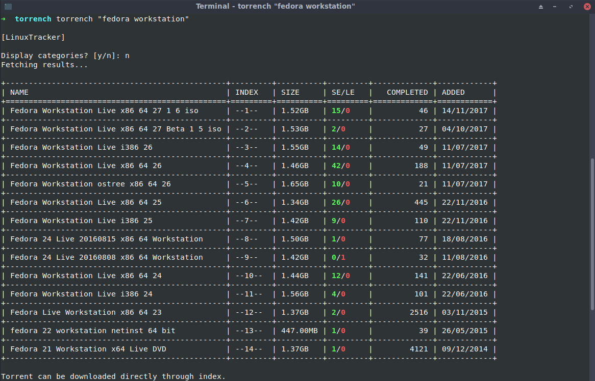
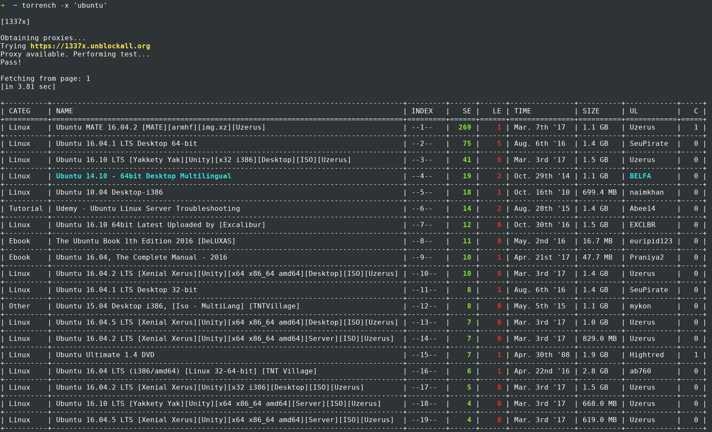
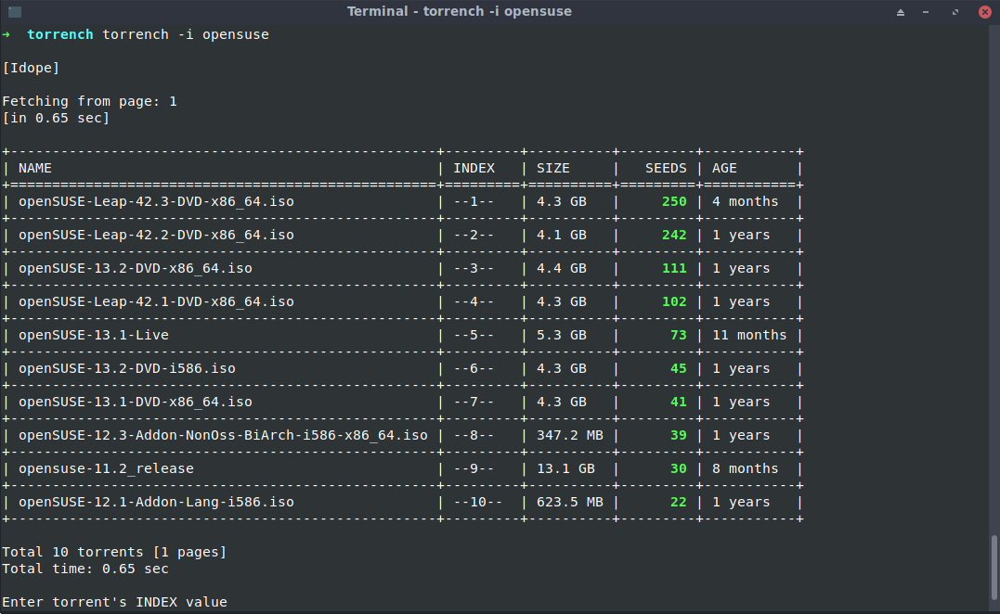
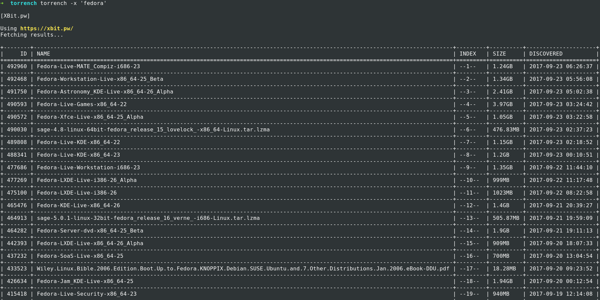
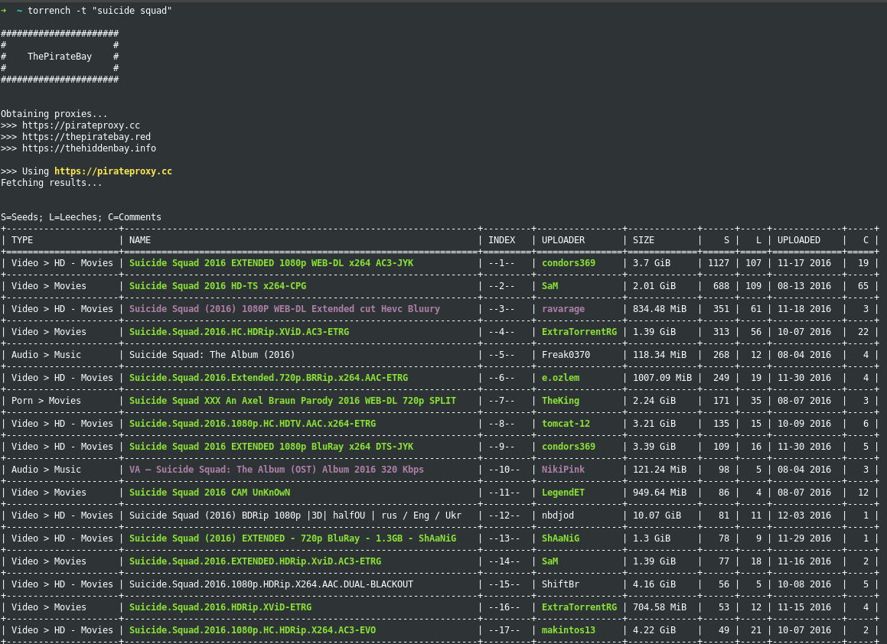
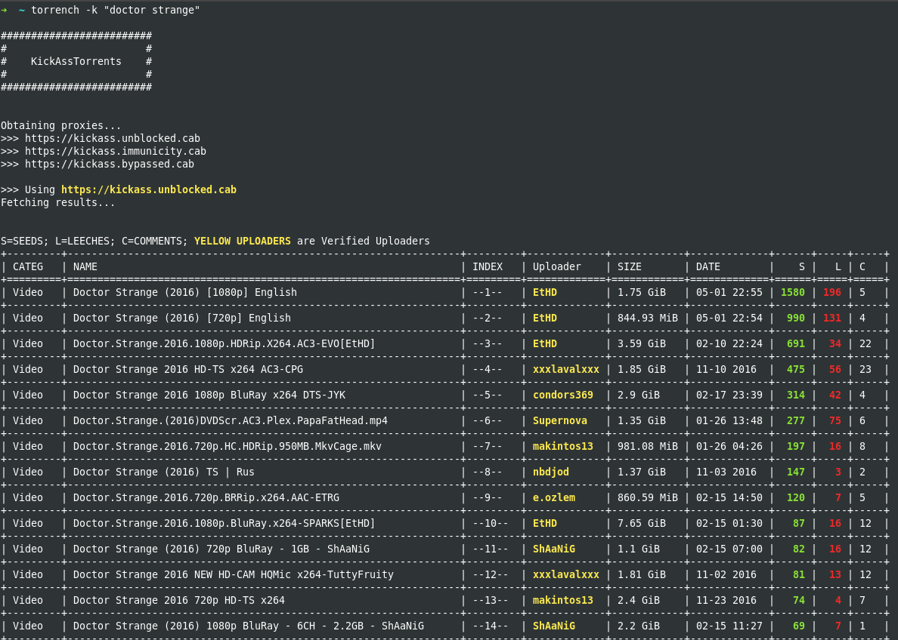
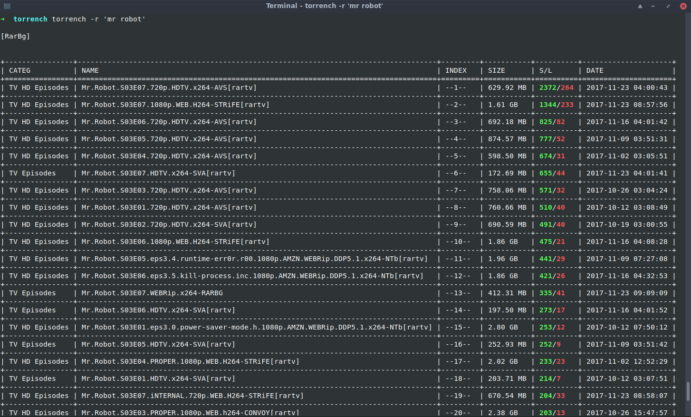
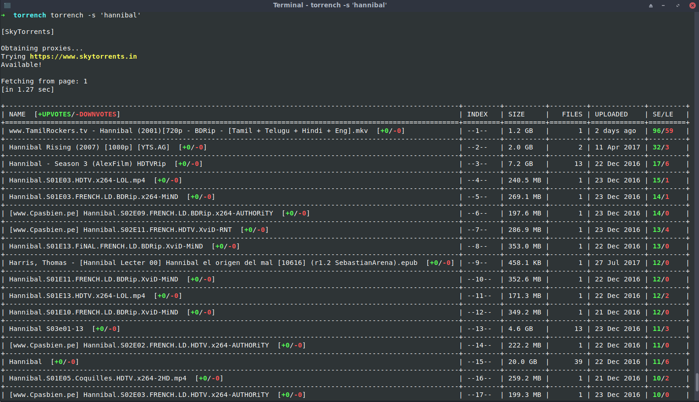
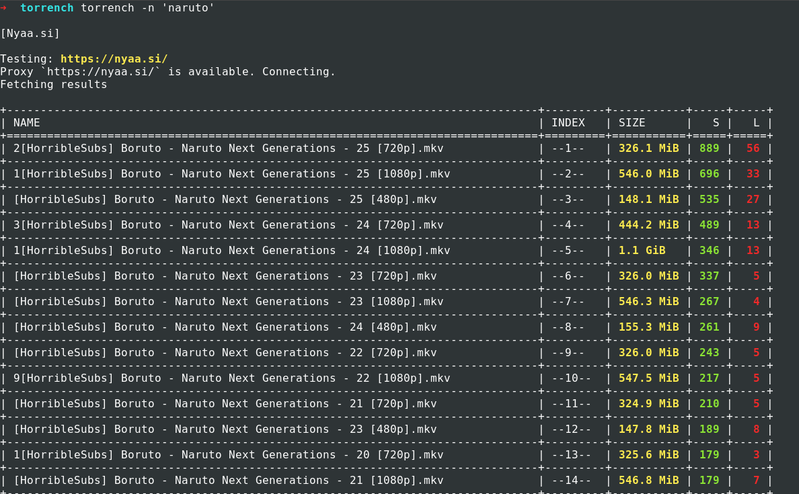
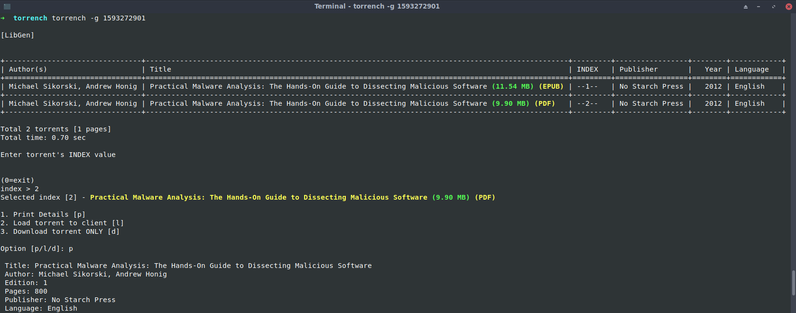

# Torrench - Command-line torrent search tool

[]()
[](https://pypi.python.org/pypi/torrench/)
[](https://aur.archlinux.org/packages/torrench/)
[]()
[](https://gemnasium.com/github.com/kryptxy/torrench)
[](https://saythanks.io/to/kryptxy)

---
* [About](https://github.com/kryptxy/torrench#about)
* [Optional Sites (TPB/KAT/1337x..) Usage](https://github.com/kryptxy/torrench#-sites-hosting-illegal-content-must-read)
* [Installation/Building from source](https://github.com/kryptxy/torrench#installationbuilding-from-source)
* [Usage and Options](https://github.com/kryptxy/torrench#usage)
* [Features](https://github.com/kryptxy/torrench#features)
* [Samples](https://github.com/kryptxy/torrench#samples)
* [Disclaimer](https://github.com/kryptxy/torrench#disclaimer)
* [Contributing (Bugs/Suggestions/Feedback)](https://github.com/kryptxy/torrench#contributing-bug-reportssuggestionsfeedbacks)
* [Contact](https://github.com/kryptxy/torrench#contact)
* [Licence](https://github.com/kryptxy/torrench#licence)


_(Click to expand) ([More samples](https://github.com/kryptxy/torrench#samples))_

---

## About
Torrench is a command-line program to search and download torrents from torrent-hosting sites. It's compatible under **Windows, Linux and MacOS**.
Torrench supports following websites:

| Sites Enabled | Sites Disabled (Requires Configuration) |
| :-------------- | :------------------------- |
|LinuxTracker `(default)`|The Pirate Bay (TPB)|
|DistroWatch `(-d)`|KickassTorrents (KAT)|
||RarBg|
||1337x|
||SkyTorrents|
||Nyaa[dot]si|
||Idope|
||LibGen (Ebooks)|
||XBit[dot]pw|

Tested on following platforms:
* **Windows:** Win7 (32bit, 64bit), Win8, Win8.1, Win10.
* **Linux:** Debian/Ubuntu, Fedora, Arch

**[Reported by users]**
* **macOS:** Yosemite, Sierra, High Sierra (10.13). [I do not own a Mac hardware, so unable to test it myself. If you find it working on your system (it should), update me?]

* Note about **LibGen** - LibGen allows searching for Ebooks using book's **ISBN-10 number only**. Searching using book title is not supported. (LibGen API does not allow searching using title). A book's ISBN-10 number can be found with a simple google search, or on websites like Amazon.

**IMPORTANT -** Please keep a close eye on [CHANGELOGS](https://github.com/kryptxy/torrench/blob/master/CHANGELOG.md). All updates info, addition setup info (whenever required), and everyting else related will be updated there.

---

#### \* Sites hosting illegal content (Disabled) (MUST READ)
By default, searching thepiratebay(TPB)/kickasstorrents(KAT)/SkyTorrents/Nyaa/XBit... from torrench is disabled. The user should configure and enable it to use. I have provided configuration steps, but before moving to configuration, please note the following:

* Using these sites is completely optional. They would never interfere/cause any problems when searching linuxtracker/distowatch.
* Using these sites in many countries is illegal. Using them can get you into un-intended troubles (e.g notices/block from ISP). Read [Legal issues](https://en.wikipedia.org/wiki/The_Pirate_Bay#Legal_issues)
* Neither I, nor the tool shall be held responsible for any action taken against you for using the above-mentioned sites from torrench.
* Illegal searches [examples](https://github.com/kryptxy/torrench#searches-considered-illegal)
* [Configuration instructions](https://github.com/kryptxy/torrench#configuration-instructions) if you decide to use them.

_Torrench initially began as a python learning project for me. I am sure there are ways to implement code I wrote in a much better/efficient way. Do [let me know](https://github.com/kryptxy/torrench#contact). Alternatively, you can also send a pull request. See [Contributing](https://github.com/kryptxy/torrench/blob/master/CONTRIBUTING.md)._

---

## Installation/Building from Source
### Linux

* Requires [Python3](https://www.python.org/downloads/)
* Arch Users - Can install from [AUR](https://aur.archlinux.org/packages/torrench/)
* Other distro users [Ubuntu,Fedora,Suse,etc...] can use pip (python3-pip) (install/upgrade)
```
$ sudo pip3 install --upgrade torrench
```
* Alternatively, build from source (python-setuptools)
```bash
$ sudo python3 setup.py install
```

### Windows
Windows does not require any additional packages. Everything required to run this software is provided in executable (Does not even require python pre-installed).

* Download latest [torrench executable](https://github.com/kryptxy/torrench/releases/download/v1.0.58/torrench-1.0.58.exe)
* That's it. Run using cmd/powershell [```> torrench.exe <search>```]

	* NOTE:
		* In windows, the default location for storing [TPB] html files is ```C:\Users\<user>\.torrench\temp```
        * For now, `linuxtacker`, `distrowatch` and `libgen` does not allow adding torrent to client from torrench. A `.torrent` file is downloaded to hard-drive. I was unable to find a way to load `.torrent` to client from torrench. I'll try to figure this out when I'll get time. Till then, torrent should be loaded manually after it is downloaded. Also, if someone has a work-around for the same, let me know?

### Osx

Please note OSX requires to install package `pyopenssl`:
```
$ pip3 install pyopenssl
```

### Configuration instructions:
1. Download/Update the [**config.ini**](https://pastebin.com/reymRHSL) file.
	* **Windows -** Copy the config file in ```C:\Users\<user>\.config\torrench\``` (create any missing directories)
	* **Linux -** Default location is ```$XDG_CONFIG_HOME/torrench/```. If ```$XDG_CONFIG_HOME``` is not defined, it fallbacks to ```$HOME/.config/torrench/``` (Create any missing directories).
	* **MacOS -** See minimal setup guide below.
2. Enable it
	* Open config.ini file
	* Set ```enable=1```
	* Save and exit
3. That's it.

_Config file [minimal setup guide](https://gist.github.com/kryptxy/788a052ab8ae9cb5dacdd72d88d3f0ea) (Windows/Linux/MacOS)_

---

## Usage
```bash
$ torrench SEARCH_STRING  ## Search linuxtracker
$ torrench -d SEARCH_STRING ## Search distrowatch
$ torrench [Options] <SEARCH_STRING>
```

## Options
```bash
optional arguments:
        -h, --help            show this help message and exit
        -i, --interactive     Enable interactive mode for searches
        -v, --version         Display version and exit.

Main Sites:
        search                Search LinuxTracker (default)
        -d, --distrowatch     Search Distrowatch

Optional Sites:
        Requires configuration (disabled by default)

        -t, --thepiratebay    Search thepiratebay (TPB)
        -k, --kickasstorrent  Search KickassTorrent (KAT)
        -s, --skytorrents     Search SkyTorrents
        -x, --x1337           Search 1337x
        -r, --rarbg           Search RarBg
        -n, --nyaa            Search Nyaa
        -i, --idope           Search Idope
        -b, --xbit            Search XBit.pw
        -g, --libgen          Search LibGen (Ebooks)

Additional options:
        --copy                Copy magnetic link to clipboard
        --top                 Get TOP torrents [TPB/SkyTorrents]
        -p LIMIT, --page-limit LIMIT
                    Number of pages to fetch results from. [default: 1] [TPB/KAT/SkyTorrents]
        -c, --clear-html      Clear all [TPB] torrent description HTML files and exit.
 ```

## Features
* Displays results in organized, tabular form.
* Load torrent to client from torrench.
* Copy magnetic link to clipboard (```$ torrench -x 'ubuntu' --copy```) [Linux systems require ```xclip``` package additionally]
* Interactive mode for searching across modules (```--interactive```)
* Get TOP torrents [TPB/SkyTorrents] (```--top```)

### Loading torrent to client

#### [LINUX/MacOS]
* Requires **[torrench.ini](https://github.com/kryptxy/torrench/blob/master/torrench.ini)** config file.
    * Default directory: **$XDG_CONFIG_HOME/torrench**
    * Fallback: **$HOME/.config/torrench/**
* Set the default torrent client name in config file.
    * ```CLIENT = <name>```
* Clients tested:
    * Transmission (```transmission-remote```, ```transmission-gtk```, ```transmission-qt```)
    * Deluge (```deluge```, ```deluge-console```)
    * qBittorrent
* If someone tried ```rtorrent```, please report.

* **Setting up ```transmission-remote```**
    * Requires running **transmission-daemon** service
    * Torrent is added to transmission client using **transmission-remote** utitlity.
    * **(IMP)** For AUTHENTICATION - ```$TR_AUTH``` environment variable is used.
        * [TR_AUTH="username:password"]
    * **(IMP)** For PORT/SERVER - Set the PORT and SERVER variable in **[torrench.ini](https://github.com/kryptxy/torrench/blob/master/torrench.ini)** file accordingly.
        * If ```$TR_AUTH``` or PORT/SERVER are not set, the following (default) values are used:
        * DEFAULTS
            * Username - [None]
            * password - [None]
            * SERVER - localhost (127.0.0.1)
            * PORT - 9091

#### [Windows]
* In windows, by default the magnetic link is opened in browser. If a torrent client is installed, the browser should automatically open the (default) client and load torrent to the client.


### Note
* A torrent might take long to fetch results. I have generally faced this issue when running torrench for the first time. When this happens:
	* Abort the ongoing search [Ctrl+C]
	* Search again. The second time generally works fine.
* KAT Proxy is quite shaky, and might not work at all times. I have been unable to find any reliable KAT proxy. Consider alternatives if they do not work.

---

## Samples
(It might be possible that samples look a little diff. from present torrench UI. **There shouldn't and won't be** any major difference though. I will update samples when there is any major change in UI/display.).

```bash
$ torrench "ubuntu desktop 16.04"	## Search Linuxtracker for Ubuntu Desktop 16.04 distro ISO
$ torrench "fedora workstation"	## Search for Fedora Workstation distro ISO
$ torrench -d "opensuse" ## Search distrowatch for opensuse ISO
$ torrench -d "solus" ## Search distrowatch for solus ISO
$ torrench -x "fedora" ## Search XBit for fedora distros ISO
```
#### Linuxtracker
```bash
$ torrench "fedora workstation"
```



#### DistroWatch
```bash
$ torrench -d "ubuntu"
```


#### 1337x
```bash
$ torrench -x "ubuntu"
```


#### Idope
```bash
$ torrench -i "opensuse"
```



#### XBit[dot]pw
```bash
$ torrench -x "fedora"
```


---
### Searches considered illegal
#### TPB Examples

```bash
$ torrench -t "game of thrones s07e02" -p 2	## Search and fetch 2 pages TPB for GOT s07e02
$ torrench -t "windows 7"
```



_(Dynamically-generated Torrent description HTML page)_


_(Click to expand)_

#### KAT Examples
```bash
$ torrench -k "doctor strange"
$ torrench -k "guardians of the galaxy"
```


#### RarBg Examples
```bash
$ torrench -r "mr robot"
```

_(Click to expand)_

#### SkyTorrents Examples
```bash
$ torrench -s "hannibal"
$ torrench -s "narcos"
```

_(Click to expand)_

#### Nyaa[dot]si Examples
```bash
$ torrench -n "naruto"
```


#### LibGen Examples (Ebooks)
```bash
$ torrench -g 1593272901
```


---

## Disclaimer
This tool fetches torrent and details from already existing torrent website(s). I do not take any responsibility for availability of any kind of torrent data, or/and hosting of any torrent website(s). Also, I am  not responsible for closing of any of the torrent website(s). As long as the website(s) (proxies) are available, data will be fetched.

## Contributing (Bug reports/suggestions/feedbacks)
Please see [CONTRIBUTING](https://github.com/kryptxy/torrench/blob/master/CONTRIBUTING.md)

## Contact
* E-mail : kryptxy@protonmail.com
* [Twitter (DM)](https://twitter.com/kryptxy)
* [Telegram](http://t.me/kryptxy)

## Thank you
* Contributors for giving your time to this project and improving it.
* Users for your valuable feedback and suggestions.

## Licence
```
Copyright (C) 2017 Rijul Gulati <kryptxy@protonmail.com>

Torrench is free software: you can redistribute it and/or modify
it under the terms of the GNU General Public License as published by
the Free Software Foundation, either version 3 of the License, or
(at your option) any later version.

Torrench is distributed in the hope that it will be useful,
but WITHOUT ANY WARRANTY; without even the implied warranty of
MERCHANTABILITY or FITNESS FOR A PARTICULAR PURPOSE.  See the
GNU General Public License for more details.

You should have received a copy of the GNU General Public License
along with Torrench.  If not, see <http://www.gnu.org/licenses/>.
```
