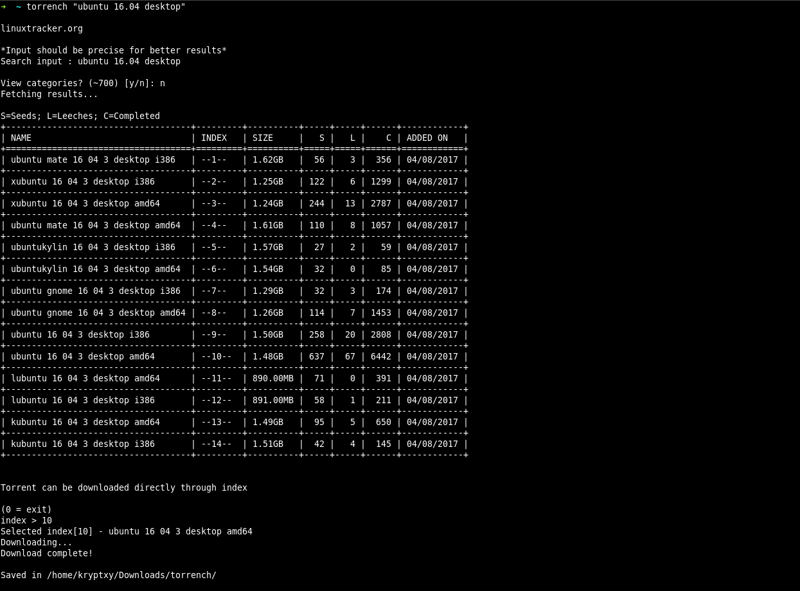

# Torrench - Command-line torrent search tool

[]()
[](https://pypi.python.org/pypi/torrench/)
[](https://aur.archlinux.org/packages/torrench/)
[]()
[](https://gemnasium.com/github.com/kryptxy/torrench)

---
* [About](https://github.com/kryptxy/torrench#about)
* [TPB / KAT / SkyTorrents / Nyaa / XBit Usage](https://github.com/kryptxy/torrench#-using-the-pirate-baytpb--kickasstorrentskat--skytorrents)
* [Installation/Building from source](https://github.com/kryptxy/torrench#installationbuilding-from-source)
* [Usage and Options](https://github.com/kryptxy/torrench#usage)
* [Features](https://github.com/kryptxy/torrench#features)
* [Samples](https://github.com/kryptxy/torrench#samples)
* [Disclaimer](https://github.com/kryptxy/torrench#disclaimer)
* [Contributing (Bugs/Suggestions/Feedback)](https://github.com/kryptxy/torrench#contributing-bug-reportssuggestionsfeedbacks)
* [Contact](https://github.com/kryptxy/torrench#contact)
* [Licence](https://github.com/kryptxy/torrench#licence)


_(Click to expand) ([More samples](https://github.com/kryptxy/torrench#samples))_

---

## About
Torrench is a command-line program to search and download torrents from torrent-hosting sites. It's compatible under **Windows, Linux and MacOS**.

Following websites are supported:
* linuxtracker.org - Download linux distros ISO torrents.
* DistroWatch - Another linux distro ISOs repository.
* Other
    * The Pirate Bay (TPB)**\***
    * KickassTorrents (KAT)**\***
    * SkyTorrents **\***
    * Nyaa[.]si **\***
    * XBit[.]pw
* _More to come..._

I have tested it on following platforms (and it works great):
* **Windows:** Win7 (32bit, 64bit), Win8, Win8.1, Win10.
* **Linux:** Debian/Ubuntu, Fedora, Arch

**[Reported by users]**
* **MacOS:** Yosemite, Sierra (10.12.6). [I do not own a Mac hardware, so unable to test it myself. If you find it working on your system (it should), update me?]


#### \* Using TPB/KAT/SkyT/Nyaa/XBit
By default, searching thepiratebay(TPB)/kickasstorrents(KAT)/SkyTorrents/Nyaa (anime)/XBit from torrench is disabled. The user should configure and enable it to use. I have provided configuration steps, but before moving to configuration, please note the following:

* Using these sites in many countries is illegal. Using them can get you into un-intended troubles (e.g notices/block from ISP). Read [Legal issues](https://en.wikipedia.org/wiki/The_Pirate_Bay#Legal_issues)
* Neither I, nor the tool shall be held responsible for any action taken against you for using the above-mentioned sites from torrench.
* Illegal searches [examples](https://github.com/kryptxy/torrench#searches-considered-illegal)
* [Configuration instructions](https://github.com/kryptxy/torrench#configuration-instructions) in case you decided to use them anyway.

_Torrench initially began as a python learning project for me. I am sure there are ways to implement code I wrote in a much better/efficient way. Do [let me know](https://github.com/kryptxy/torrench#contact). Alternatively, you can also send a pull request. See [Contributing](https://github.com/kryptxy/torrench/blob/master/CONTRIBUTING.md)._

---

## Installation/Building from Source
### Linux

* Requires [Python3](https://www.python.org/downloads/)
* Arch Users - Can install from [AUR](https://aur.archlinux.org/packages/torrench/)
* Other distro users [Ubuntu,Fedora,Suse,etc...] can use pip (python3-pip) (install/upgrade)
```
$ sudo python3 -m pip install --upgrade torrench
## OR
$ sudo pip3 install --upgrade torrench
```
* Alternatively, build from source (python-setuptools)
```bash
$ sudo python3 setup.py install
```

### Windows
Windows does not require any additional packages. Everything required to run this software is provided in executable (Does not even require python pre-installed).

* Download latest [torrench executable](https://github.com/kryptxy/torrench/releases/download/v1.0.51/torrench-1.0.51.exe)
* That's it. Run using cmd/powershell [```> torrench.exe <search>```]

	* NOTE:
		* In windows, the default location for storing [TPB] html files is ```C:\Users\<user>\.torrench\temp```

### Configuration instructions:
1. Download **config.ini** from [Sync](https://ln.sync.com/dl/26cd652e0/nqzvd8b3-9gqs3pdu-32btqm2c-9r6mbymm) / [TinyUpload](http://s000.tinyupload.com/index.php?file_id=23632516396955453086) or [Ghostbin](https://ghostbin.com/paste/jzguv)
	* **Windows -** Copy the config file in ```C:\Users\<user>\.config\torrench\``` (create any missing directories)
	* **Linux -** Default location is ```$XDG_CONFIG_HOME/torrench/```. If ```$XDG_CONFIG_HOME``` is not defined, it fallbacks to ```$HOME/.config/torrench/``` (Create any missing directories).
	* **MacOS -** Next bullet (setup instructions).
2. Enable it
	* Open config.ini file
	* Set ```enable=1```
	* Save and exit
3. That's it.

_Config file [minimal setup guide](https://gist.github.com/kryptxy/788a052ab8ae9cb5dacdd72d88d3f0ea) (Windows/Linux/MacOS)_

---

## Usage
```bash
$ torrench SEARCH_STRING  ## Search linuxtracker
$ torrench -d SEARCH_STRING ## Search distrowatch
$ torrench [Options] <SEARCH_STRING>
```

## Options
```bash
    positional arguments:
    search                Enter search string

    optional arguments:
    -h, --help            show this help message and exit
    -d, --distrowatch     Search distrowatch
    -t, --thepiratebay    Search thepiratebay (TPB)
    -k, --kickasstorrent  Search KickassTorrent (KAT)
    -s, --skytorrents     Search SkyTorrents
	-n, --nyaa			  Search Nyaa.si (Anime tracker)
    --top                 Get top torrents
    -p LIMIT, --page-limit LIMIT
                          Number of pages to fetch results from (1 page = 30 results). [default: 1]
    -c, --clear-html      Clear all [TPB] torrent description HTML files and exit.
    -v, --version         Display version and exit.
 ```

## Features (Needs to be re-written)
* Supports all \*nix distros
* Displays results in organized, tabular form.
* Add torrent directly to client from torrench. See [this]() for more.
* [linuxtracker] Supports filtering search using categories

**[TPB/KAT]**
* Surf torrents Ad-free
* Fetch Torrents on basis of pages [1 page = 30 results (max)] [(-p) argument].
* **Display colored results on basis of uploader's status** (Very useful when choosing torrent).
	* TPB:
		* VIP Uploaders [results in green]
		* Trusted Uploader [results in magenta]
		* General Uploader
	* KAT (KickassTorrents):
		* Verified uploaders [Uploader's text in yellow]
		* Seeds [in green]
		* Leeches [in red]
* Add torrent directly to torrent client through **magnetic links** without opening/fetching details.
* Get upstream link which can be opened using browser.

**[TPB-Only]**
* Get complete torrent details (Description, comments, torrent download). **Torrent details are available in dynamically-generated HTML pages.**
* Fetch Comments on basis of pages [Useful when torrent has large number of comments, and not all comments are intended to be fetched].
* Get TPB Top Torrents (--top)

### Note
* A torrent might take long to fetch results. I have generally faced this issue when running torrench for the first time. When this happens:
	* Abort the ongoing search [Ctrl+C]
	* Search again. The second time generally works fine.
* KAT Proxy is quite shaky, and might not work at all times. I have been unable to find any reliable KAT proxy. If you know of some working proxy, you can edit KAT_URL in config.ini  with that working proxy. Alternatively, use TPB or SkyTorrents. They are pretty reliable and works most of the time.

---

## Samples

```bash
$ torrench "ubuntu desktop 16.04"	## Search Linuxtracker for Ubuntu Desktop 16.04 distro ISO
$ torrench "fedora workstation"	## Search for Fedora Workstation distro ISO
$ torrench -d "opensuse" ## Search distrowatch for opensuse ISO
$ torrench -d "solus" ## Search distrowatch for solus ISO
```
#### Linuxtracker




#### DistroWatch


---
### Searches considered illegal
#### TPB Examples
```bash
$ torrench -t "suicide squad"	## Search suicide squad TPB
$ torrench -t "game of thrones s07e02" -p 2	## Search and fetch 2 pages TPB for GOT s07e02
```


_(Dynamically-generated Torrent description HTML page)_


_(Click to expand)_

#### KAT Examples
```bash
$ torrench -k "doctor strange"
$ torrench -k "guardians of the galaxy"
```


_(Click to expand)_

#### SkyTorrents Examples
```bash
$ torrench -s "hannibal"
$ torrench -s "narcos"
```


_(Click to expand)_

---

## Disclaimer
This tool fetches torrent and details from already existing torrent website(s). I do not take any responsibility for availability of any kind of torrent data, or/and hosting of any torrent website(s). Also, I am  not responsible for closing of any of the torrent website(s). As long as the website(s) (proxies) are available, data will be fetched.

## Contributing (Bug reports/suggestions/feedbacks)
Please see [CONTRIBUTING](https://github.com/kryptxy/torrench/blob/master/CONTRIBUTING.md)

## Contact
* E-mail : kryptxy@protonmail.com
* [Twitter (DM)](https://twitter.com/kryptxy) [Quick-response]
* [Telegram](http://t.me/kryptxy) [Quick-response]

## Thank you
* Contributors for giving your time to this project and improving it.
* Users for your valuable feedback and suggestions.
* MacOS testers for testing torrench and reporting.

## Licence
```
Copyright (C) 2017 Rijul Gulati <kryptxy@protonmail.com>

Torrench is free software: you can redistribute it and/or modify
it under the terms of the GNU General Public License as published by
the Free Software Foundation, either version 3 of the License, or
(at your option) any later version.

Torrench is distributed in the hope that it will be useful,
but WITHOUT ANY WARRANTY; without even the implied warranty of
MERCHANTABILITY or FITNESS FOR A PARTICULAR PURPOSE.  See the
GNU General Public License for more details.

You should have received a copy of the GNU General Public License
along with Torrench.  If not, see <http://www.gnu.org/licenses/>.
```
